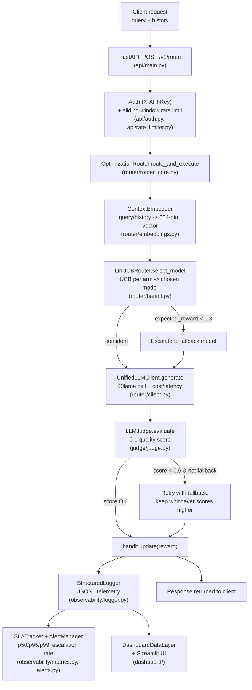

# LLM Inference Cost & Latency Optimization Router

A production-shaped system that routes each incoming query to the LLM that
gives the best quality-for-cost, learning the routing policy **online** with
a contextual bandit instead of a pre-trained classifier. Built as a
portfolio project for ML/AI systems interviews, so this README doubles as
interview prep: every non-obvious design choice below is written as the
"why," not just the "what," and Section 12 collects the questions this
project is designed to be grilled on.

## Table of Contents

1. [The Problem This Solves](#1-the-problem-this-solves)
2. [Architecture Overview](#2-architecture-overview)
3. [Why a Contextual Bandit Instead of a Classifier](#3-why-a-contextual-bandit-instead-of-a-classifier)
4. [Why LinUCB Specifically](#4-why-linucb-specifically)
5. [Non-Stationarity: Decay, Shocks, and Escalation](#5-non-stationarity-decay-shocks-and-escalation)
6. [Reward Function Design](#6-reward-function-design)
7. [Realistic Evaluation: Simulator, Sequential A/B Testing, Doubly Robust OPE](#7-realistic-evaluation-simulator-sequential-ab-testing-doubly-robust-ope)
8. [Production Layer: Observability, SLA Tracking, Alerting, Dashboard](#8-production-layer-observability-sla-tracking-alerting-dashboard)
9. [Deployment API: Auth, Rate Limiting, Integration Tests](#9-deployment-api-auth-rate-limiting-integration-tests)
10. [Zero-Cost Design: Local Ollama Models + Simulated Pricing](#10-zero-cost-design-local-ollama-models--simulated-pricing)
11. [Known Limitations & Future Work](#11-known-limitations--future-work)
12. [Interview Prep: Anticipated Questions & Answers](#12-interview-prep-anticipated-questions--answers)
13. [Project Structure](#13-project-structure)
14. [Setup & Running It](#14-setup--running-it)
15. [Test Coverage](#15-test-coverage)

---

## 1. The Problem This Solves

Every company serving LLM products faces the same tension: cheap/fast
models are cheap and fast but sometimes wrong; expensive/slow models are
usually right but burn budget and latency on queries that didn't need it.
Routing 100% of traffic to the best model wastes money. Routing 100% to the
cheapest model wastes quality. The right policy is *per-query*, and it has
to keep working as traffic composition shifts and as models silently
degrade - it can't be a policy you set once and forget.

This project builds that router: a system that learns, from live traffic
and zero labeled training data, which model to send each query to, while
tracking cost, latency, and quality as first-class production metrics.

## 2. Architecture Overview



**Phase-by-phase:**

- **Phase 1 - Foundation.** `router/client.py` unifies calls to local Ollama
  models behind one interface that always returns latency, simulated cost,
  and token counts, plus a mock mode for free/instant iteration.
  `router/embeddings.py` turns a query (or multi-turn conversation) into a
  dense context vector via `sentence-transformers` (`all-MiniLM-L6-v2`,
  384-dim).
- **Phase 2 - Core Routing Intelligence.** `router/bandit.py` implements
  LinUCB with exponential decay. `judge/judge.py` scores responses with an
  LLM-as-judge (plus a programmatic length-bias penalty).
  `router/router_core.py`'s `OptimizationRouter` ties it together: embed →
  select arm → generate → judge → escalate if needed → update the bandit →
  log.
- **Phase 3 - Realistic Evaluation.** `experiments/simulator.py` replays
  streaming traffic with topic-distribution shifts and can inject a
  deterministic quality "shock" on a model mid-run.
  `experiments/validation.py` implements sequential A/B testing and doubly
  robust off-policy evaluation to validate the router against baselines
  without the pitfalls of naive methods (Section 7).
- **Phase 4 - Production Layer.** `observability/` turns every routing
  decision into structured JSONL telemetry, rolling SLA percentiles, and
  threshold-based alerts. `dashboard/` (Streamlit) visualizes it: cost /
  quality / latency vs. static baselines, routing distribution over time,
  and escalation frequency.
- **Deployment.** `api/` exposes the router as a FastAPI service with
  API-key auth and per-key rate limiting. `tests/test_integration_pipeline.py`
  proves the whole chain - API → bandit → judge → escalation → logger →
  observability/dashboard consumers - works together, not just in isolation.

## 3. Why a Contextual Bandit Instead of a Classifier

A supervised classifier needs **labeled training data**: examples of
"query X should have gone to model Y." That label doesn't exist ahead of
time in this problem - there's no ground truth for "the best model for this
query" until you've actually tried a model and scored the result. A
classifier also can't safely improve itself in production; every update
requires a fresh labeled batch, a retrain, and a redeploy, so it's
structurally *offline* and *static* between deployments.

A contextual bandit is built for exactly this setting:

- It learns **online**, from its own outcomes, one query at a time - no
  separate labeling step.
- It formalizes the **explore/exploit tradeoff** explicitly (Section 4),
  instead of hoping a classifier's soft-max probabilities happen to behave
  like calibrated uncertainty.
- It's the right abstraction for **decisions under uncertainty with a
  reward signal**, which is what routing actually is: a sequential decision
  problem, not a static labeling problem. This is the same class of
  reasoning production recommender/ad systems use, and it's the framing
  interviewers are checking for when they ask "how would you route traffic
  between models."
- It adapts to a **non-stationary environment** (traffic mix shifts, models
  degrade) by design, via decay (Section 5) - a classifier has no built-in
  notion of "forget what I learned three weeks ago."

## 4. Why LinUCB Specifically

The context here is continuous (a 384-dim embedding, not a handful of
discrete features), and the reward needs an explicit, principled
uncertainty estimate to safely gate escalation (`bandit_uncertainty` feeds
directly into the router's fallback logic). That combination points
specifically at LinUCB over the alternatives:

| Alternative | Why not, for this problem |
|---|---|
| **Epsilon-greedy** | Explores uniformly at random with probability ε, ignoring context entirely - it can't tell "I'm uncertain about this *specific* query" from "I'm uncertain in general." No usable uncertainty signal for escalation. |
| **UCB1 (context-free)** | Only tracks one estimate per arm regardless of the query - assumes the best model is the same for every query, which is the exact assumption this project exists to avoid. |
| **Thompson Sampling (contextual)** | A reasonable alternative (Bayesian, often stronger empirically) - but its exploration is stochastic per draw, which makes behavior harder to reason about and to test deterministically. LinUCB's confidence bound is closed-form and reproducible, which matters a lot for an interview-defensible, testable system. |
| **Neural bandits / deep RL** | Massive overkill for ~4 arms and a linear reward assumption; would need far more data than a mock/local-model demo can generate, and would be much harder to defend the internals of in an interview. |

**LinUCB's mechanics**, concretely (`router/bandit.py`):

For each arm (model) `a`, maintain `A_a` (a `d x d` matrix, `d=384`) and
`b_a` (a `d`-vector):

```
theta_a = A_a^{-1} b_a                                  # ridge-regression reward estimate
UCB_a(x) = x·theta_a + alpha * sqrt(x^T A_a^{-1} x)     # exploitation + exploration bonus
```

The router picks `argmax_a UCB_a(x)`. The first term is the model's
predicted reward for this context (exploitation); the second is the width
of the confidence interval around that estimate (exploration) - arms with
little data have a wide interval and get a boost, so the bandit tries them
even without knowing yet whether they're good. `alpha` (default `1.0`)
controls how much weight exploration gets relative to the point estimate.

This is a closed-form, per-context confidence bound - it's the reason the
router can say "how sure am I" per query, not just "which model is best on
average," which is exactly the signal `OptimizationRouter` needs for its
escalation logic.

## 5. Non-Stationarity: Decay, Shocks, and Escalation

Production LLM traffic is not IID. Two failure modes matter:

**1. Distribution shift** (e.g. traffic moves from mostly-chat to
mostly-code) - handled by giving the bandit a memory that fades:

```
A_a <- gamma * A_a + x x^T        # gamma = 0.99 by default
b_a <- gamma * b_a + r * x
```

`gamma < 1.0` exponentially discounts old observations every time an arm is
updated, so the bandit's belief about an arm reflects *recent* evidence
more than ancient evidence - a sliding-window memory without needing to
literally store and re-process a window of raw history.

**2. Sudden model degradation** ("shock") - `judge/judge.py` exposes
`set_shock(model, penalty)` to deterministically subtract a fixed penalty
from a model's judge score from that point on (used by both the simulator
and tests to prove the bandit reacts). Combined with decay, a shocked
model's rewards drop, its `A`/`b` state gets pulled toward the new (bad)
reality within a handful of decayed updates, and the bandit routes away
from it - without any special-cased "shock detection" code path; it falls
out of the same online-learning machinery used for ordinary drift.

**Escalation** (`router/router_core.py`) is the safety net on top of the
bandit, with two independent triggers:

- **Low confidence**: `expected_reward < CONFIDENCE_THRESHOLD (0.3)` and the
  bandit's pick isn't already the fallback model → escalate immediately,
  before even generating a response. This is what makes a *cold* bandit
  safe: with zero data every arm ties at an expected reward of `0.0`, which
  is below threshold, so the very first queries in a fresh deployment go
  straight to the trusted fallback rather than to an untested model.
- **Low judge score**: after generating and judging a response, if
  `score < JUDGE_SCORE_THRESHOLD (0.6)` and the chosen model wasn't already
  the fallback → retry with the fallback and keep whichever response scored
  higher. This catches cases where the bandit was *confident* but wrong for
  this particular query.

The bandit is still updated with whatever model actually ran (including an
escalated fallback), so escalations feed back into learning instead of
being thrown away.

## 6. Reward Function Design

```
cost_penalty = simulated_cost * 0.1
final_reward = max(0.0, judge_score - cost_penalty)
```

Quality (`judge_score`, `[0, 1]`) is the dominant term; cost is a small
linear penalty rather than a hard constraint. Why not optimize cost and
quality as two separate objectives? A single scalar reward is what LinUCB's
math requires (it's a linear-reward bandit), and folding cost in as a
penalty rather than a constraint lets the bandit make the tradeoff
per-query itself - a cheap model that's "good enough" beats an expensive
model that's marginally better, without the router needing a hand-tuned
rule for when that's true. `max(0.0, ...)` keeps rewards non-negative,
which keeps the linear reward assumption well-behaved (an unboundedly
negative reward from a very expensive, mediocre response would distort the
ridge-regression estimate far more than clipping does).

## 7. Realistic Evaluation: Simulator, Sequential A/B Testing, Doubly Robust OPE

### The simulator (`experiments/simulator.py`)

Generates streaming traffic across topic buckets (chat/math/code) with a
configurable **mid-run distribution shift** and an optional **quality
shock** on a specific model at a specific step - so the validation harness
below isn't testing against a static, IID dataset, which real production
traffic never is.

### Why not a naive single-shot t-test?

Two reasons a standard t-test on router-vs-baseline is actively misleading
here:

1. **Non-IID data.** The simulator explicitly shifts the traffic
   distribution and can shock a model mid-run. A t-test assumes the
   samples are drawn from one fixed distribution throughout - false by
   construction in this setup, so its p-value doesn't mean what it claims
   to mean.
2. **Peeking.** In a real streaming deployment, you look at metrics
   continuously, not once at a fixed sample size decided in advance.
   Repeatedly computing a p-value and stopping "when it looks significant"
   inflates the false-positive rate (this is the classic "peeking problem"
   / optional stopping bias) - exactly what dashboards invite you to do.

**Sequential A/B testing** (`ValidationHarness.sequential_ab_test`) sidesteps
both: instead of one p-value, it tracks **cumulative reward per policy**
(router vs. each static baseline) query-by-query, so you can watch how each
policy's cumulative performance actually evolves through the distribution
shift and the shock - the shape of the curve *is* the evidence, and it's
valid to look at any point, because nothing about the method assumes a
fixed stopping time.

### Why not naive offline replay for policy evaluation?

Once you have logged data from the deployed (bandit) policy, a natural
question is "what would policy Y have scored, using only this log?" - i.e.
off-policy evaluation. Two standard approaches, both flawed alone:

- **Direct Method (DM)**: train a reward model on the logs, use it to
  predict the reward the new policy would have gotten. Biased whenever the
  reward model is wrong, with no way to detect that from the estimate
  itself.
- **Inverse Propensity Scoring (IPS)**: reweight each logged reward by
  `1 / propensity` (the probability the logging policy would have taken
  that action). Unbiased in principle, but propensities near zero blow the
  variance up - a single rare, heavily-reweighted sample can dominate the
  estimate.

**Doubly Robust (DR)** estimation (`ValidationHarness
.doubly_robust_off_policy_evaluation`) combines them:

```
if target_arm == logged_arm:
    DR = predicted_reward_target + (logged_reward - predicted_reward_logged) / propensity
else:
    DR = predicted_reward_target
```

It uses the reward model as a baseline (like DM), then corrects it with an
IPS-weighted *residual* only on the actions that were actually observed
(instead of reweighting the full reward). The key property: DR is unbiased
if **either** the propensity model **or** the reward model is correct - it
only needs one of the two to be right, not both, which is why it's the
standard answer when an interviewer asks "how do you evaluate a new
policy without deploying it."

## 8. Production Layer: Observability, SLA Tracking, Alerting, Dashboard

- **Structured logging** (`observability/logger.py`): every routing
  decision becomes one JSONL line (context/bandit internals, judge score,
  cost, latency, escalation info) - the append-only, schema-per-line format
  a real pipeline would ingest into a warehouse or an observability
  backend, and the single source of truth every other Phase 4 component
  reads from.
- **SLA tracking** (`observability/metrics.py`): rolling **p50/p95/p99**
  latency per model via a fixed-size `deque` (not a running mean - mean
  latency hides long-tail outliers, which is exactly what users notice),
  plus rolling escalation rate per model as an early signal that a model is
  degrading.
- **Alerting** (`observability/alerts.py`): compares those SLA metrics
  against configurable thresholds and fires (optionally webhook-backed)
  alerts on violation - the same metric shape SLATracker produces flows
  straight into AlertManager.check_metrics() with no glue code, which
  `tests/test_integration_pipeline.py` verifies end-to-end.
- **Dashboard** (`dashboard/`): `data_layer.py` aggregates the JSONL logs
  with **zero external dependencies beyond numpy** (deliberately no
  pandas here, to keep the aggregation layer itself trivially
  dependency-light and robust); `app.py` is the Streamlit UI on top of it -
  router cost/quality/latency **projected against static "always use model
  X" baselines** (computed from that model's own observed per-query
  averages, so no extra simulation runs are needed), routing distribution
  over time (rolling window, so it stays responsive to a live shift instead
  of being smoothed away by cumulative history), and escalation frequency.

## 9. Deployment API: Auth, Rate Limiting, Integration Tests

`api/main.py` exposes `POST /v1/route` (plus an unauthenticated
`GET /health` liveness probe):

- **Auth** (`api/auth.py`): a static API-key check via the `X-API-Key`
  header, keys sourced from the `ROUTER_API_KEYS` env var - the minimum
  viable gate for a portfolio deployment; the natural next step in a real
  system would be per-tenant keys with scopes/quotas in a real datastore.
- **Rate limiting** (`api/rate_limiter.py`): an in-memory **sliding
  window**, keyed per API key. Sliding beats fixed-window because a fixed
  window (reset on the clock every N seconds) lets a client burst up to 2x
  the limit right at the boundary; looking back exactly `window_seconds`
  from "now" closes that gap. In-memory (not Redis) is a deliberate scope
  decision for a single-process deployment - documented in the code as the
  first thing to swap for a shared store if this had to run multi-worker.
  Auth is checked *before* rate limiting, and rate-limits by the
  *authenticated* key, so an attacker spamming invalid keys can't burn a
  legitimate client's quota.
- **Integration tests** (`tests/test_integration_pipeline.py`): the piece
  that proves this isn't just unit-tested in isolation. A real (unmocked)
  embedder, bandit, and judge are wired behind the actual FastAPI endpoint,
  and the tests assert on real emergent behavior - e.g. a cold-start bandit
  deterministically escalates its first-ever query - rather than mocking
  the escalation decision itself. They also verify the log a request
  produces is exactly consumable by `SLATracker`, `AlertManager`, and
  `DashboardDataLayer`, so the whole Phase 2 → Phase 4 → API chain is
  checked together, not just each link.

## 10. Zero-Cost Design: Local Ollama Models + Simulated Pricing

This project intentionally never calls a paid hosted API. Every "model" is
a locally-served [Ollama](https://ollama.com) model
(`llama3.2:1b`, `llama3.2:3b`, `phi3`, `mistral`), and every dollar figure
in the system is a **simulated cost**, not a real charge:

```python
PRICING_PER_1M_TOKENS = {
    "llama3.2:1b": 0.10,   # proxy for a cheap tier   (e.g. GPT-4o-mini / Haiku class)
    "llama3.2:3b": 0.20,   # proxy for a mid-cheap tier
    "phi3":        0.50,   # proxy for a mid tier
    "mistral":     1.00,   # proxy for an expensive tier (e.g. GPT-4o / Opus class)
}
cost = (total_tokens / 1_000_000) * price_per_1m
```

Each local model is mapped to a price tier that mirrors where a comparable
*hosted* model would sit, so the cost/quality/latency tradeoff the router
has to navigate is realistic even though no real money moves. `latency_ms`
is **real** wall-clock time from the actual local inference call (or, in
mock mode, a model-size-scaled synthetic value) - only cost is simulated,
latency is genuinely measured.

**Why this matters for the argument, not just the budget:** it means every
result in this repo (bandit convergence, A/B curves, dashboard numbers) was
produced by a system facing a *real* cost/latency/quality tradeoff
structure, not a toy with made-up numbers - the routing decisions are
meaningfully hard in the same shape they'd be hard with real GPT-4o-mini vs.
GPT-4o pricing, just at zero dollars.

On top of that, `mock_mode=True` (the default everywhere in this repo -
`UnifiedLLMClient`, `ContextEmbedder`, and the API's `ROUTER_MOCK_MODE`)
removes the Ollama dependency entirely for fast, free, deterministic
iteration:

- `UnifiedLLMClient._mock_generate`: skips the real model call, returns a
  synthetic response with a model-size-scaled latency and the same cost
  formula above.
- `ContextEmbedder`: seeds `numpy`'s RNG from a hash of the input text, so
  the same query always produces the same mock embedding within a process -
  deterministic enough to unit-test bandit convergence without waiting on
  real inference or downloading `sentence-transformers`.
- `LLMJudge`: returns a deterministic score derived from `(model, prompt,
  response)` instead of calling a judge model.

Every test in this repo runs in mock mode (57 tests, sub-3-second full
suite) - real Ollama inference is opt-in (`mock_mode=False`, or
`ROUTER_MOCK_MODE=false` for the API), for when you actually want to watch
real models get routed to.

## 11. Known Limitations & Future Work

Being upfront about this, because it's a legitimate finding, not something
swept under the rug:

**Mock-mode traffic tends to collapse onto a single arm.** Running
`python -m experiments.simulator` produced a 300-query batch where routing
converged to 100% `mistral` after the first couple of queries, despite a
configured mid-run distribution shift and a quality shock on
`llama3.2:1b`. Root cause, traced end-to-end:

1. A cold bandit ties every arm at `expected_reward = 0.0`, so the very
   first query escalates to the fallback model (`mistral`) via the
   low-confidence path (Section 5) - by design, and correct.
2. `bandit.update()` only touches the arm that actually ran. Every other
   arm's `A`/`b` stay at their literal initial values - untouched, not just
   unfavored.
3. Because `gamma = 0.99 < 1.0` is applied to `A_mistral` on every update,
   its inverse `A_inv` is inflated slightly in *all* directions - including
   ones orthogonal to anything actually observed. That inflated uncertainty
   term, combined with a rapidly growing exploitation term (`mistral`'s
   judge score is high in mock mode), pushes `mistral`'s UCB durably above
   every untouched arm's static `UCB = alpha * 1.0` - so the bandit keeps
   picking `mistral` on its own, without ever tripping the escalation flag
   again, and no other arm ever gets a second data point to compete with.
4. Mock embeddings compound this: they're independent random unit vectors
   per query text with no real semantic structure, so even if another arm
   *were* tried once, that one data point wouldn't transfer to help predict
   reward on a different, unrelated-looking query - real
   `sentence-transformers` embeddings (topically clustered) would very
   likely behave differently here.

**How this could be fixed** (not yet implemented, deliberately left as the
next iteration rather than patched live mid-demo):

- **Forced warm-start exploration** - round-robin the first `k` queries
  per arm before letting UCB drive selection, so every arm gets at least
  one real data point before the loop above can take hold.
- **Thompson Sampling** instead of LinUCB - its stochastic draws don't
  have the same deterministic "whoever wins UCB first, wins forever"
  failure mode.
- **Global decay** - decay every arm's `A`/`b` every timestep, not only the
  arm that was updated, so uncertainty doesn't inflate asymmetrically for
  arms that happen to get picked early.
- **A true epsilon-floor** - guarantee a small constant probability of
  exploring a random arm regardless of UCB, independent of confidence.
- **Real embeddings** - swap in actual `sentence-transformers` output
  (`mock_mode=False`) so semantically similar queries genuinely share
  structure, which is the assumption the linear reward model depends on.

This is exactly the kind of "what would you do differently" answer worth
having ready - see Section 12.

## 12. Interview Prep: Anticipated Questions & Answers

**Q: Why a bandit instead of a classifier? Isn't this just classification
with extra steps?**
No labels exist ahead of time for "which model should this query have
gone to" - you only find out a model's quality *after* trying it. A bandit
learns from that outcome directly and online; a classifier needs a labeled
dataset and a retrain/redeploy cycle to update at all. See Section 3.

**Q: Why LinUCB over Thompson Sampling, epsilon-greedy, or a deep bandit?**
Continuous context + need for an explicit, reproducible uncertainty
estimate (the escalation logic depends on it) rules out epsilon-greedy
and context-free UCB1. LinUCB gives that uncertainty in closed form and is
deterministic, which matters for testability; Thompson Sampling is a
reasonable alternative but its randomized draws are harder to unit-test
and reason about; a deep bandit is overkill for 4 arms and would need far
more data than this system generates. See Section 4.

**Q: How does the bandit avoid getting stuck once it's converged, if the
world changes?**
Two mechanisms: exponential decay (`gamma=0.99`) on the arm actually being
updated fades old evidence, and the confidence-based escalation path
re-routes to the fallback whenever the bandit's own uncertainty says it
isn't sure - so a sudden shock shows up as low judge scores, which lowers
that arm's expected reward, which (given enough decayed updates) eventually
loses the UCB comparison. See Section 5 - and Section 11 for where this
mechanism currently breaks down in mock mode.

**Q: What is the reward function, and why is it built that way?**
`max(0, judge_score - 0.1 * simulated_cost)` - quality-dominant with cost as
a soft linear penalty rather than a hard constraint, so the tradeoff is
made per-query by the bandit itself instead of by a hand-tuned rule. See
Section 6.

**Q: Why not just run a t-test to compare the router against a static
policy?**
Two reasons: the traffic isn't IID (the simulator injects distribution
shifts and shocks, which a t-test assumes away), and continuously watching
a metric and stopping when it looks significant is the classic peeking /
optional-stopping bias. Cumulative sequential tracking sidesteps both by
not assuming a fixed distribution or a fixed stopping time. See Section 7.

**Q: How do you evaluate a new routing policy without deploying it?**
Doubly Robust off-policy evaluation: combine a reward-model estimate (like
Direct Method) with an IPS-weighted correction on the residual, only where
actions were actually observed. It's unbiased if *either* the reward model
*or* the logged propensities are correct - strictly more robust than either
DM or IPS alone. See Section 7.

**Q: Walk me through what happens end-to-end for one query.**
Query → embed to a 384-dim vector → LinUCB picks the highest-UCB arm →
if expected reward is below 0.3 and it isn't already the fallback, escalate
immediately → generate a response → judge scores it 0-1 → if the score is
below 0.6 and the model wasn't already the fallback, retry with the
fallback and keep whichever scores higher → the bandit is updated with
whatever model actually ran → the whole decision is written as one JSONL
line. See the Section 2 diagram.

**Q: How would you scale the rate limiter / API for real traffic?**
The current limiter is a per-process in-memory sliding window - correct
for one worker, wrong the moment you run more than one, since each process
would have its own independent counter. The fix is a shared store (Redis,
via `INCR`+`EXPIRE` or a sorted-set sliding window) so every worker sees
the same count per key. Documented as the known next step in
`api/rate_limiter.py`.

**Q: What's a limitation you found, and how would you fix it?**
Have this one ready cold - it's Section 11 verbatim: mock-mode traffic
collapses onto a single arm because of an interaction between cold-start
escalation, per-update-only decay inflating uncertainty asymmetrically, and
unstructured mock embeddings. Fixes: forced warm-start exploration,
Thompson Sampling, decaying all arms every timestep instead of only the
updated one, an epsilon-floor, or real embeddings.

**Q: Why zero-cost / local models instead of just calling a real API with a
small budget?**
Two reasons: it makes the project runnable and demoable by anyone with zero
setup cost or API keys, and - more importantly for the engineering
argument - it doesn't make the problem fake. Costs are simulated using real
hosted-model pricing tiers mapped onto local models of comparable size, so
the cost/quality/latency tradeoff the bandit has to solve is structurally
the same one it would face with real GPT-4o-mini/GPT-4o pricing. Latency is
real, only cost is simulated. See Section 10.

## 13. Project Structure

```
router/            Phase 1-2: client, embeddings, bandit, router core
  client.py           UnifiedLLMClient - Ollama calls, simulated cost, mock mode
  embeddings.py        ContextEmbedder - query/history -> 384-dim vector
  bandit.py            LinUCBRouter - contextual bandit with decay
  router_core.py        OptimizationRouter - ties it all together + escalation

judge/              LLM-as-a-judge scoring with length-bias mitigation
  judge.py

experiments/        Phase 3: realistic evaluation
  simulator.py          TrafficSimulator - streaming traffic, shifts, shocks
  validation.py          ValidationHarness - sequential A/B test, doubly robust OPE

observability/      Phase 4: production telemetry
  logger.py             StructuredLogger - JSONL telemetry
  metrics.py             SLATracker - rolling p50/p95/p99, escalation rate
  alerts.py               AlertManager - SLA threshold alerting

dashboard/          Phase 4: visualization
  data_layer.py          DashboardDataLayer - log aggregation, zero pandas
  chart_utils.py          Rolling-window/baseline-projection helpers
  app.py                    Streamlit UI

api/                Deployment: FastAPI service
  main.py                /health, /v1/route
  auth.py                  API-key auth
  rate_limiter.py           Sliding-window rate limiter
  dependencies.py            Router singleton wiring
  schemas.py                  Request/response models

tests/              57 tests across every module above, plus:
  test_integration_pipeline.py   Full pipeline through the real API
```

## 14. Setup & Running It

```bash
python3 -m venv venv
source venv/bin/activate
pip install -r requirements.txt
```

**Run the test suite** (mock mode, no Ollama required):

```bash
pytest tests/ -v
```

**Generate sample telemetry** (mock mode):

```bash
python -m experiments.simulator     # writes observability/router_logs.jsonl
```

**View the dashboard:**

```bash
streamlit run dashboard/app.py
```

**Run the API:**

```bash
export ROUTER_API_KEYS=dev-local-key
uvicorn api.main:app --reload
# docs at http://127.0.0.1:8000/docs
curl -X POST http://127.0.0.1:8000/v1/route \
  -H "X-API-Key: dev-local-key" -H "Content-Type: application/json" \
  -d '{"query": "Write a Python function to reverse a string."}'
```

**To use real local models instead of mock mode:** install
[Ollama](https://ollama.com), pull the four models:

```bash
for m in llama3.2:1b llama3.2:3b phi3 mistral; do ollama pull "$m"; done
```

then set `mock_mode=False` when constructing
`UnifiedLLMClient`/`ContextEmbedder` (or `ROUTER_MOCK_MODE=false` for the
API).

## 15. Test Coverage

57 tests, full suite runs in about 2 seconds (mock mode, no external
services):

```
tests/test_alerts.py                 - AlertManager threshold/hook behavior
tests/test_api.py                    - Auth, rate limiting, API contract
tests/test_bandit.py                 - LinUCB init, update, decay/adaptation
tests/test_chart_utils.py            - Dashboard rolling-window/baseline math
tests/test_client.py                 - Mock generation, cost calculation
tests/test_dashboard_app.py          - Streamlit smoke tests (AppTest)
tests/test_dashboard_data.py         - Log aggregation correctness
tests/test_embeddings.py             - Mock/empty/conversation embeddings
tests/test_integration_pipeline.py   - Full pipeline through the real API
tests/test_judge.py                  - Scoring, length-bias, shock
tests/test_logger.py                 - JSONL telemetry writing
tests/test_metrics.py                - Rolling SLA percentiles
tests/test_router_core.py            - Escalation logic
tests/test_simulator.py              - Traffic generation, distribution shift
tests/test_validation.py             - Sequential A/B test, doubly robust OPE
```
